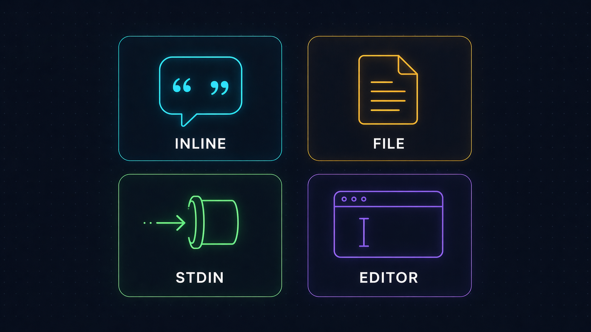
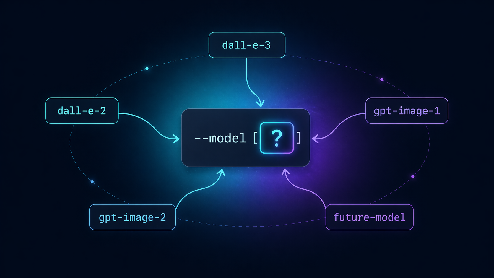
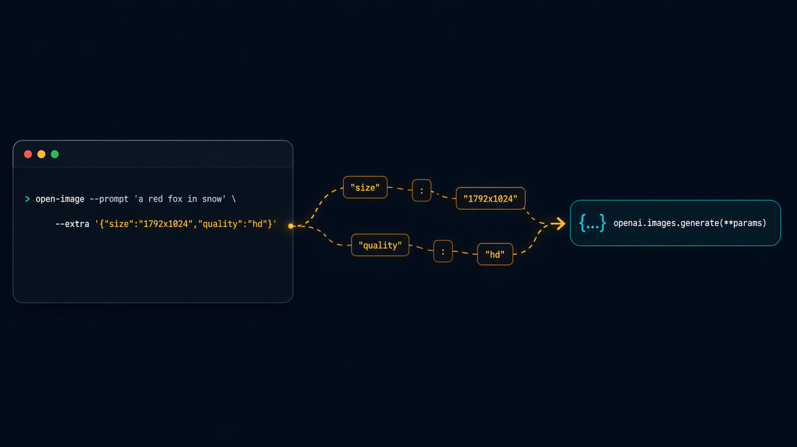

<p align="center">
  
</p>

<h1 align="center">open-image</h1>

<p align="center">
  <b>Tiny CLI for OpenAI image generation. Prompt in, PNG out. Model-agnostic.</b>
</p>

<p align="center">
  <a href="https://pypi.org/project/open-image/"></a>
  <a href="https://pypi.org/project/open-image/"></a>
  <a href="LICENSE"></a>
  <a href="https://github.com/tvtdev94/open-image/stargazers"></a>
</p>

<p align="center">
  
</p>

---

## Why another CLI?

Every serious image-gen workflow needs a **stable, forgettable command** — one you can pipe into, script around, and re-run six months later without rewriting. The official SDKs are fine for apps; they're heavy for "just give me a PNG."

`open-image` is **one file, ~120 lines, pure stdlib + `openai`**. No framework, no config, no lock-in to a specific model.

```bash
pip install open-image
export OPENAI_API_KEY=sk-...
open-image --prompt "a red fox in a snowy forest, cinematic"
# → /abs/path/output/20260423-223012-a1b2c3d4.png
```

That's it.

---

## Features

### Four ways to feed a prompt

<p align="center">
  
</p>

| Method | Example |
|---|---|
| **Inline** | `open-image --prompt "a red fox in snow"` |
| **File**   | `open-image --prompt-file prompts/scene.txt` |
| **Stdin**  | `echo "a blue cat" \| open-image` |
| **Editor** | `open-image` (no args in a TTY → opens `$EDITOR`, or `notepad` on Windows, `vi` otherwise) |

The resolver picks them in that order. Lines starting with `#` in the editor buffer are stripped — write notes to yourself without polluting the prompt.

---

### Model-agnostic by design

<p align="center">
  
</p>

`--model` is a **flag, not a constant**. The day a new image model ships, swap the string — no code change, no version bump, no fork:

```bash
open-image --model dall-e-3      --prompt "..."
open-image --model gpt-image-2   --prompt "..."   # when your org is verified
open-image --model future-model  --prompt "..."   # whenever it arrives
```

Default is `gpt-image-2`. Change per call, or `alias open-image='open-image --model dall-e-3'` in your shell if you prefer a different default.

---

### `--extra` escape hatch

<p align="center">
  
</p>

Any keyword the API accepts, `--extra` forwards verbatim to `openai.images.generate(**params)`. Zero client-side validation — the API is the source of truth:

```bash
open-image \
  --model dall-e-3 \
  --extra '{"size":"1792x1024","quality":"hd","style":"vivid"}' \
  --prompt "a lone surfer at dawn, Hokusai woodblock style"

open-image \
  --model dall-e-2 \
  --extra '{"size":"512x512","n":4}' \
  --prompt "abstract watercolor studies"
```

If you pass a wrong key, the API error surfaces verbatim — exactly what you want for debugging. No wrapper in the way.

---

## Install

### From PyPI (recommended)

```bash
pip install open-image
```

### With pipx (isolated global command)

```bash
pipx install open-image
```

### From source

```bash
git clone https://github.com/tvtdev94/open-image
cd open-image
pip install -e .
```

---

## Setup

Set your OpenAI API key (must have image-generation credit):

```bash
# Option A — environment variable (recommended)
export OPENAI_API_KEY=sk-...

# Option B — per-call flag
open-image --api-key sk-... --prompt "..."
```

---

## Flags

| Flag | Default | Purpose |
|---|---|---|
| `--prompt` | — | Inline prompt text |
| `--prompt-file` | — | Path to a file containing the prompt |
| `--model` | `gpt-image-2` | Any OpenAI image model (`dall-e-3`, `dall-e-2`, `gpt-image-1`, …) |
| `--extra` | `{}` | JSON object forwarded to `images.generate` |
| `--out-dir` | `./output` | Where to save PNGs (auto-created) |
| `--api-key` | `$OPENAI_API_KEY` | Override via flag if not in env |

---

## Output

```
./output/{YYYYMMDD-HHMMSS}-{uuid8}.png
```

One PNG per `response.data` item (so `n=4` → four files). Absolute path(s) printed to stdout, one per line — friendly to `xargs`, `fzf`, `wl-copy`, whatever you pipe into.

```bash
open-image --prompt "a corgi" | tee -a log.txt
open-image --prompt "a corgi" | head -n1 | xargs -I{} open {}    # macOS preview
```

---

## Gallery

All generated by `open-image` at `dall-e-3 / quality=hd`:

<p align="center">
  
</p>

<table>
  <tr>
    <td></td>
    <td></td>
  </tr>
  <tr>
    <td align="center"><sub><i>A close-up cinematic macro of a bee hovering over a lotus at sunrise.</i></sub></td>
    <td align="center"><sub><i>A bustling night market in a cyberpunk Hanoi alleyway.</i></sub></td>
  </tr>
</table>

---

## Error handling

Every error path exits with a clear, actionable message:

- **No API key** → `ERROR: No API key. Set OPENAI_API_KEY env or pass --api-key.`
- **`--extra` not valid JSON** → parser error with column offset
- **Empty prompt** → `ERROR: Empty prompt.`
- **API failure** (auth, model access, invalid params) → API error string forwarded verbatim
- **Un-writable `--out-dir`** → `PermissionError` surfaced with the path

---

## Model notes

- **`gpt-image-2`** requires an organization verification step on the OpenAI dashboard. First call returns `403` until you verify.
- **`dall-e-3`** works out of the box. It returns a URL by default; always pass `"response_format": "b64_json"` in `--extra` for deterministic offline storage.
- **`dall-e-2`** supports `n > 1` and smaller sizes — ideal for batch ideation.

---

## Philosophy

Three principles, one file:

- **YAGNI** — no MCP server, no HTTP wrapper, no plugin system. If your agent has a shell, it can use this.
- **KISS** — argparse + stdlib + one SDK call. Zero abstractions between you and the API.
- **DRY** — `--extra` means the tool never needs a new flag per new API param.

The whole tool fits in your head. When a future model adds a parameter, you already know how to use it.

---

## License

MIT © 2026 [tvtdev94](https://github.com/tvtdev94)
